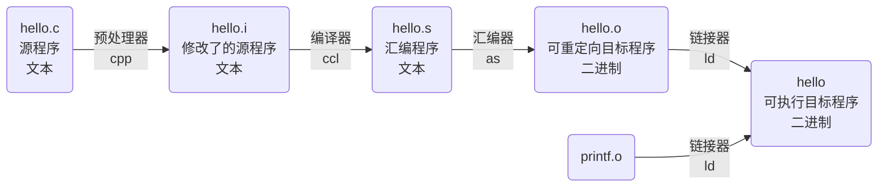
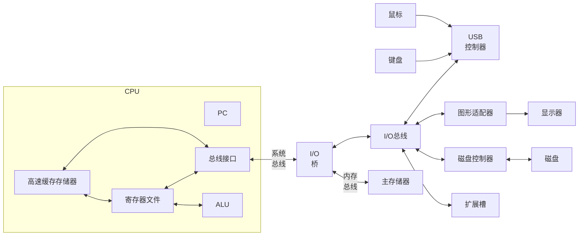

# 第一章：计算机系统漫游

​	信息就是位+上下文。

## 程序被其他程序翻译成不同的格式

​	 **gcc** 编译器驱动程序读取源程序文件 *hello.c* ，并把它翻译成一个可执行目标文件 *hello* ，这个翻译过程课分为四个阶段完成，执行这四个阶段的程序（**预处理器**、**编译器**、**汇编器**和**链接器**）一起构成了编译系统。




- 预处理阶段。**预处理器**（ **cpp** ）根据以字符 **#** 开头的命令，修改原始的 C 程序。比如 *#include<stdio.h>* 命令告诉预处理器读取系统头文件 *stdio.h* 的内容，并把它直接插入程序**文本**中。结果得到了另一个 C 程序，通常是以 **.i** 作为文件扩展名。

- 编译阶段。**编译器**（ **ccl** ）将文本文件 *hello.i* 翻译成**文本**文件 *hello.s* ，它包含一个汇编语言程序。该程序包含函数 *main* 的定义。

- 汇编阶段。**汇编器**（ **as** ）将 *hello.s* 翻译成机器语言指令，把这些指令打包成一种叫做*可重定向目标程序*的格式，并将结果保存在目标文件 *hello.o* 中。 *hello.o* 文件是一个**二进制文件**。

- 链接阶段。 *hello* 程序调用了 *printf* 函数，它是每个 C 编译器都提供的标准 C 库中的一个函数。 *printf* 函数存在于一个名为 *printf.o* 的单独的预编译好了的目标文件中，而这个文件必须以某种方式合并到我们的 *hello.o* 程序中。**链接器**（ **ld** ）就负责处理这种工作。结果得到 *hello* 文件，可以被加载到内存中，由系统执行。

## 处理器读并解释存储在内存中的指令



​	主存是由一组**动态随机存取存储器**（ **DRAM** ）芯片组成的。利用**直接存储器存取**（ **DMA** ）技术，数据可以不通过处理器而直接从磁盘到达主存。 L1 和 L2 高速缓存是用一种叫做**静态随机访问存储器**（ **SRAM** ）的技术实现的，利用了高速缓存的**局部性原理**，即程序具有访问局部区域里的数据和代码的趋势。

​	所有应用程序对硬件的操作尝试都必须通过操作系统。操作系统有两个基本功能：（1）防止硬件被失控的应用程序滥用；（2）向应用程序提供简单一致的机制来控制复杂而又通常大不相同的低级硬件设备。**文件**是对 I/O 设备的抽象表示，**虚拟内存**是对主存和磁盘 I/O 设备的抽象表示，**进程**则是对处理器、主存和 I/O 设备的抽象表示。

​	**进程**是操作系统对一个正在运行的程序的一种抽象。在一个系统上可以同时运行多个进程，而每个进程都好像在独占地使用硬件。而**并发运行**，则是说一个进程的指令和另一个进程的指令是交错执行的。无论是在单核还是多核系统中，一个 CPU 看上去都像是在并发地执行多个进程，这是通过处理器在进程间切换来实现的。操作系统实现这种交错执行的机制称为**上下文切换**。

​	操作系统保持跟踪进程运行所需的所有状态信息。这种状态，也就是**上下文**，包括许多信息，比如 **PC** 和**寄存器**文件的当前值，以及**主存**的内容。在任何一个时刻，单处理器系统都只能执行一个进程的代码。当操作系统决定要把控制权从当前进程转移到某个新进程时，就会进行上下文切换，即保存当前进程的上下文、恢复新进程的上下文，然后将控制权传递到新进程。

​	从一个进程到另一个进程的转换是由操作系统**内核**管理的。内核是操作系统代码常驻主存的部分。当应用程序需要操作系统的某些操作时，比如读写文件，它就执行一条特殊的**系统调用** (system call) 指令，将控制权传递给内核。然后内核执行被请求的操作并返回应用程序。注意，内核不是一个独立的进程。相反，它是<span style="background-color: yellow;">系统管理全部进程所用代码和数据结构的集合</span>。

​	在现代系统中，一个进程实际上可以由多个称为**线程**的执行单元组成，每个线程都运行在进程的上下文中，并**共享**同样的**代码**和**全局数据**。由于网络服务器中对并行处理的需求，线程成为越来越重要的编程模型，因为<span style="background-color: yellow;">多线程之间比多进程之间更容易共享数据</span>，也因为线程一般来说都比进程更高效。

- **本质区别：**进程是操作系统资源分配的基本单位，而线程是处理器任务调度和执行的基本单位。
- **包含关系：**一个进程至少有一个线程，线程是进程的一部分，所以线程也被称为轻权进程或者轻量级进程。
- **资源开销：**每个进程都有独立的地址空间，进程之间的切换会有较大的开销；线程可以看做轻量级的进程，同一个进程内的线程共享进程的地址空间，每个线程都有自己独立的运行栈和程序计数器，线程之间切换的开销小。
- **影响关系：**一个进程崩溃后，在保护模式下其他进程不会被影响，但是一个线程崩溃可能导致整个进程被操作系统杀掉，所以多进程要比多线程健壮。

[线程之间共享了哪些资源？](https://zhuanlan.zhihu.com/p/519803985)

> ​    函数运行时的信息保存在栈帧中，栈帧中保存了函数的返回值、调用其它函数的参数、该函数使用的局部变量以及该函数使用的寄存器信息，此外， CPU 执行指令的信息保存在一个叫做程序计数器的寄存器中，通过这个寄存器我们就知道接下来要执行哪一条指令。由于操作系统随时可以暂停线程的运行，因此我们保存以及恢复程序计数器中的值就能知道线程是从哪里暂停的以及该从哪里继续运行了。
>
> ​    由于线程运行的本质就是函数运行，函数运行时信息是保存在栈帧中的，因此每个线程都有自己独立的、私有的栈区。同时函数运行时需要额外的寄存器来保存一些信息，像部分局部变量之类。这些寄存器也是线程私有的，一个线程不可能访问到另一个线程的这类寄存器信息。
>
> ​    从上面的讨论中我们知道，到目前为止，所属<span style="background-color: yellow;">线程的栈区、程序计数器、栈指针以及函数运行使用的寄存器</span>是线程私有的。以上这些信息有一个统一的名字，就是**线程上下文**。
>
> ​    我们也说过操作系统调度线程需要随时中断线程的运行并且需要线程被暂停后可以继续运行，操作系统之所以能实现这一点，依靠的就是线程上下文信息。除此之外，剩下的都是线程间共享资源。包括**代码区**、**数据区**和**堆区**。

​	**虚拟内存**是一个抽象概念，它为每个进程提供了一个假象，即每个进程都在独占地使用主存。每个进程看到的内存都是一致的，称为**虚拟地址空间**。 Linux 中，地址空间最上面的区域是保留给操作系统中的代码和数据的，这对所有进程来说都是一样。地址空间的底部区域存放用户进程定义的代码和数据。

每个进程看到的虚拟地址空间由大量准确定义的区构成，每个区都有专门的功能。从最低的地址开始，逐步向上介绍。

- **程序代码和数据**。对所有的进程来说，代码是从同一固定地址开始，紧接着的是和全局变量相对应的数据位置。代码和数据区是直接按照可执行目标文件的内容初始化的。

- **堆**。代码和数据区后紧随着的是运行时堆。代码和数据区在进程一开始运行时就被指定了大小，与此不同，当调用像 *malloc* 和 *free* 这样的 C 标准库函数时，堆可以在运行时动态地扩展和收缩。

- **共享库**。大约在地址空间的中间部分是一块用来存放像 C 标准库和数学库这样的共享库的代码和数据的区域。

- **栈**。位于用户虚拟地址空间顶部的是**用户栈**，编译器用它来实现函数调用。和堆一样，用户栈在程序执行期间可以动态地扩展和收缩。特别地，每次我们调用一个函数时，栈就会增长；从一个函数返回时，栈就会收缩。

- **内核虚拟内存**。地址空间顶部的区域是为内核保留的。不允许应用程序读写这个区域的内容或者直接调用内核代码定义的函数。相反，它们必须调用内核来执行这些操作。

​	虚拟内存的运作需要硬件和操作系统软件之间精密复杂的交互，包括对处理器生成的每个地址的硬件翻译。基本思想是把一个进程虚拟内存的内容存储在磁盘上，然后用主存作为磁盘的高速缓存。

​	**文件**就是字节序列，每个 I/O 设备，包括磁盘、键盘、显示器，甚至网络，都可以看成是文件。系统中的所有输入输出都是使用一小组称为 **Unix I/O** 的系统函数调用读写文件来实现的。文件向应用程序提供了一个统一的视图，来看待系统中可能含有的所有各式各样的 I/O 设备。

<span style="background-color: yellow;">**Amdahl 定律**（阿姆达尔定律）</span>：考量提升系统性能的效果

> ​	主要思想是，当我们对系统的某个部分加速时，其对系统整体性能的影响取决于该部分的**重要性**和**加速程度**。
>
> ​	若系统执行某应用程序需要的时间为 $T_{old}$ ，假设系统某部分所需执行时间与该时间占比为 $\alpha$ ，而该部分性能提升比例为 $k$ ，因此，总的执行时间为 $T_{new} = (1-\alpha)T_{old}+(\alpha T_{old})/k=T_{old}[(1-\alpha)+\alpha/k]$，因此，可以计算出加速比为
> $$
> S=\frac{T_{old}}{T_{new}}=\frac{1}{(1-\alpha)+\alpha/k}
> $$

按照系统层次由高到低的顺序重点强调三个层次的并发：

1. **线程级并发**

   自 20 世纪 60 年代初期出现时间共享以来，计算机系统就开始有了对并发执行的支持。传统配置的**单处理器系统**是通过正在执行的线程间快速切换来实现的。随着**多核处理器**和**超线程**的出现，**多处理器系统**变得更加常见。

   > 超线程技术与多核体系结构的区别如下：①超线程技术是通过延迟隐藏的方法，提高了处理器的性能，本质上，就是多个线程共享一个处理单元。因此，采用超线程技术所获得的性能并不是真正意义上的并行。从而采用超线程技术获得的性能提升，将会随着应用程序以及硬件平台的不同而参差不齐。②多核处理器是将两个甚至更多的独立执行单元，嵌入到一个处理器内部。每个指令序列（线程），都具有一个完整的硬件执行环境，所以各线程之间就实现了真正意义上的并行。

2. **指令级并发**

   **流水线**（旁注：添加跳转到第四章）的使用，可以把一条指令所需要的活动划分成不同的步骤，可以并行地操作。如果处理器可以达到比一个周期一条指令更快的执行效率，就称之为**超标量处理器**。

3. **单指令、多数据并行**

   提供这些 **SIMD** 指令多是为了提高处理影像、声音和视频数据应用的执行速度。可靠的方法是用编译器支持的特殊的向量数据类型来写程序。

# 第四章：处理器体系结构

## 指令集体系结构

​	一个处理器支持的指令和指令的字节级编码称为它的**指令集体系结构（ ISA ）**。 ISA 在编译器编写者和处理器设计人员之间提供了一个概念抽象层，编译器编写者只需要指导允许哪些指令，以及是如何编码的；而处理器设计者必须建造出执行这些指令的处理器。定义一个指令集体系结构包括定义各种**状态单元**、**指令集**和它们的**编码**、一组**编程规范**和**异常事件处理**。

​	程序中的每条指令都会读取或修改处理器状态的某些部分，这称为**程序员可见状态**，包括数个**程序寄存器**、四个**一位**的[**条件码**](#条件码)、**程序计数器（ PC ）**、**程序状态**和**内存**。内存从概念上来说就是一个很大的字节数组，保存着程序和数据。我们假设用**虚拟地址**来引用内存位置。硬件和操作系统软件联合起来将虚拟地址翻译成实际或**物理地址**。状态码表明程序执行的总体状态，会指示是正常运行还是出现了某种异常。

<a id="条件码">条件码</a>:

> 1. **CF**：进位标志。最近的操作使最高位产生了进位。可用来检查无符号操作的溢出；
> 2. **ZF**：零标志。最近的操作得出的结果为0；
> 3. **SF**：符号标志。最近的操作得到的结果为负数；
> 4. **OF**：溢出标志。最近的操作导致一个补码溢出——正溢出或负溢出。
>
>    例如XOR，进位标志和溢出标志会设置成0。对于移位操作，进位标志将被设置为最后一个被移出的位，而溢出标志设置为0。INC和DEC指令会设置溢出和零标志。

​	 15 个程序寄存器中每个都有一个相对应的范围在 0 到 *0xE* 之间的**寄存器标识符**。程序寄存器存在 CPU 中的一个**寄存器文件**中，这个寄存器文件就是一个小的、以寄存器 ID 作为地址的随机访问存储器。在指令编码以及我们的硬件设计中，当需要指明不应访问任何寄存器时，就用 ID 值 *0xF* 来表示。 

​	 *x86-64* 有时称为“复杂指令集计算机”（CISC），与“精简指令集计算机”（RISC）相对。以下是两者的一些区别：

|               CISC               |                  RISC                  |
| :------------------------------: | :------------------------------------: |
|             指令很多             |      指令数量少，通常少于 100 个       |
| 编码是可变长度的，可以是1~15字节 |         编码固定长度为 4 字节          |
|   可以对内存进行算术和逻辑运算   |     允许内存使用的只有load和store      |
|  有条件码，可以用于条件分支检测  | 没有条件码，会将测试结果保存到寄存器中 |
|         栈密集的过程衔接         |          寄存器密集的过程衔接          |

## 逻辑设计和硬件控制语言 HCL

​	要实现一个数字系统需要三个主要的组成部分：计算对位进行操作的函数的组合逻辑、存储位的存储器单元，以及控制存储器单元更新的时钟信号。

​	逻辑门是数字电路的基本计算单元，将很多的逻辑门组合成一个网，构建计算块，称为**组合电路**。有以下限制：

1. 每个逻辑门的输入必须连接到下述选项之一：`1）`一个系统输入（称为主输入）；`2）`某个存储器单元的输出；`3）`某个逻辑门的输出。
2. 两个或多个逻辑门的输出不能连接到一起。
3. 这个网必须是无欢的。

​	一个简单但很有用的组合电路，称为**多路复用器**，在单个位的多路复用器中，两个数据信号是输入 a 和 b ，控制信号输入是 s 。当 s 是 1 时，输出为 a ，反之输出为 b 。

  ```c++
bool out = (s && a) || (!s && b);
  ```

​	类似地，我们也可以设计出字级的多路复用器，由多个相同的子电路组成。值得注意的是，在**硬件控制语言（ HCL ）**中的逻辑表达式中是没有短路求值的。

​	组合电路从本质上来讲，不存储任何信息。它们只是简单地响应输入信号，产生等于输入的某个函数的输出。为了产生**时序电路**，必须引入按位存储信息的设备。存储设备（旁注：添加跳转到第六章）都是由同一个**时钟**控制的，时钟是一个周期性信号。考虑两种存储器设备：

- 时钟寄存器（简称**寄存器**）存储某个位或字。时钟信号控制寄存器加载输入值。
- 随机访问存储器（简称**内存**）存储多个字，用地址来选择读写哪个字。例子有：`1）`处理器的虚拟内存系统；`2）`寄存器文件。

## 流水线的通用原理

​	流水线提高了系统的**吞吐量**，但也会轻微地增加**延迟**。

# 第六章：存储器层次结构

​	存储器系统是一个具有不同容量、成本和访问时间的存储器设备的层次设备。

## 存储技术

### 随机访问存储器

​	随机访问存储器（Random-Access Memory，RAM）分为两大类：静态的和动态的。静态 RAM （ SRAM ）比动态 RAM （ DRAM ）更快，但也贵得多。相对的来说， SRAM 的存储空间小于 DRAM。

1. 静态 RAM

​	 SRAM 将每个位存储在一个双稳态的存储器单元内。每个单元是用一个六晶体管电路来实现的。这个电路有这样一个属性，它可以无限期地保持在两个不同的电压配置或状态之一。其他任何状态都是不稳定的。由于 SRAM 存储器单元的双稳态特性，只要有电，它就会永远地保持它的值。即使有干扰，例如电子噪声，来扰乱电压，当干扰消除时，电路就会恢复到稳定值。

2. 动态 RAM

​	 DRAM 将每个位存储为对一个电容的充电。这个电容非常小。 DRAM 存储器可以制造得非常密集，每个单元由一个电容和一个访问晶体管组成。但是，不同的是， DRAM 存储单元对干扰非常敏感。当电容的电压被扰乱后，它就永远不会恢复了。暴露在阳光下会导致电容电压的变化，可以制作成数码相机的传感器。

​	很多原因会导致漏电，但是计算机运行的时钟周期远小于失去电荷的时间。内存系统必须周期性地通过读出，然后重写来刷新内存中的每一位。有些系统也使用纠错码。

3. 传统的 DRAM

​	 DRAM 芯片中的单元被分为 $d$ 个**超单元**，每个超单元都由 $w$ 个 DRAM 单元组成。超单元被组织成一个 $r$ 行 $c$ 列的长方形阵列，这里 $rc=d$ 。每个超单元都有形如 $(i,j)$ 的地址。信息通过称为**引脚**的外部连接器流入和流出芯片。每个引脚携带一个 1 位的信号。每个 DRAM 芯片被连接到某个称为**内存控制器**的电路，这个电路可以一次传送 $w$ 位到每个 DRAM 芯片或一次从每个 DRAM 芯片传出 $w$ 位。为了读出超单元 $(i,j)$ 的内容，内存控制器将行地址 $i$ 发送给 DRAM ，然后是列地址 $j$ 。 DRAM 把超单元 $(i,j)$ 的内容发送回控制器作为响应。会首先将整一行的内容复制到一个内部行缓冲区，接下来收到列地址后，再发送具体的内容到内存控制器。行地址 $i$ 和列地址 $j$ 称为 RAS （Row Access Strobe，行访问选通脉冲）请求和 CAS（Column Access Strobe，列访问选通脉冲）请求，共享相同的 DRAM 地址引脚。二维阵列而不是线型数组的一个原因是降低芯片上的地址引脚数量，但必须分两次发送地址，增加了访问时间。

4. 增强的 DRAM

- 快页模式 DRAM （Fast Page DRAM， FPM DRAM）。传统的 DRAM 将超单元的一整行复制到它的内部行缓冲区中，使用一个，然后丢弃剩余的。 FPM DRAM 允许对同一行连续地访问可以直接从行缓冲区得到服务。
- 扩展数据输出 DRAM （Extended Data Out DRAM，EDO DRAM）。 FPM DRAM 的一个增强的形式，允许各个 CAS 信号在时间上靠的更紧密一些。
- 同步 DRAM（Synchronous DRAM，SDRAM）。用与驱动内存控制器相同的外部时钟信号的上升沿来替代许多控制信号。能够比异步的存储器更快地输出它的超单元的内容。
- 双倍数据速率同步 DRAM（Double Data-Rate Synchronous DRAM，DDR SDRAM），是对 SDRAM 的一种增强，它使用两个时钟沿作为控制信号，从而使速度翻倍。不同类型的 DDR SDRAM 是用提高有效带宽的很小的预取缓冲区的大小来划分的： DDR （ 2 位）、 DDR2 （ 4 位）、 DDR4 （ 8 位）。
- 视频 RAM （Video RAM，VRAM）。它用在图形系统的帧缓冲区中。 VRAM 的思想与 FPM DRAM 类似。两个主要的区别是：1） VRAM 的输出是通过依次对内部缓冲区的整个内容进行位移得到的；2） VRAM 允许对内存并行地进行读和写。因此，系统可以在写下一次更新的新值的同时，用帧缓冲区中的像素刷屏幕。

5. 非易失性存储器

​	非易失性存储器即使是在关闭电源后，仍然保存着信息。**只读存储器**（Read-Only Memory，ROM）是以它们能够被重编程（写）的次数和对它们进行重编程所用的机制进行区分，并不是只能读不能写。

​	
