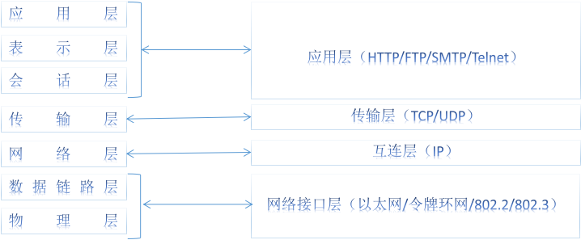

# Web 简介

## 技术变迁和生态

​	**互联网**（Internet，亦称因特网）发源于 1969 年，用来连接美国的国防计算机设备。互联网充当信息高速公路把计算机串联起来。**万维网**诞生于 90 年代初，是建立在互联网之上的全球性的、交互的、分布式图文信息系统。它原本只是基于 Internet 的一种网络服务（除此之外还有邮件、新闻列表和即时通讯等服务），但它的出现极大地推动了互联网的发展，构成了互联网最主要的部分。

​	互联网技术本质上是基于连接的技术，连接两端（客户端和服务器）形态的演进深刻地影响了软件开发技术（尤其是客户端）的发展，粗略分有四个阶段：

- 桌面本地应用 Windows

  从 90 年代到 2000 年初，软件开发是以桌面本地应用（如 Office 套件） **C/S （Client / Server）**模式为主

- 网页应用

  之后十几年大规模迁移到了基于万维网的 **B/S （Browser / Server）**模式（各大网站），软件产品乃至基础设施通过弹性分配的方式成为各种在线服务。

- 移动互联网本地应用复兴

   2009 年后随着 iPhone / Android 智能手机的兴起， C/S 模式在移动平台领域（Native APP）独领风骚

- 响应式网页应用

   2014 年年底 HTML5 标准得以最终确立，移动互联网的快速发展，建立了基于 Web 的跨终端跨平台的技术接口，可以想见未来移动应用也将逐步 B/S 化，迁移到移动页面应用的形态上来

​	无论是 C/S 模式，还是 B/S 模式，只要是存在数据通讯，就需要连接客户和服务两端，服务器是数据生产方，客户端是数据消费方。 C/S 桌面本地应用的开发技术包括 `VC++(MFC)` 、 `Java(Swing)` 、 `VC#(.NET)` 、`QT` 等，网页应用包括`HTML`、`CSS`、`JavaScript`、`Flex以及PHP`、`JSP`、`Ruby`、`ASP`等，移动本地应用包括 Android （Java 和 C）和 iPhone （Objective-C 和 Swift）。 C/S 和 B/S 的本质区别在于前者的客户端是基于**本地操作系统**，后者的客户端基于 **Web 浏览器**。所以前者的开发人员要关注的是操作系统提供的开放接口（API / SDK，比如微软的 Windows SDK 和苹果的 Cocoa），而后者需要熟悉 Web 技术标准（HTML）。根据客户端体量的大小，称呼前者为胖客户端模式，后者称为瘦客户端模式。

​	对应于早期的**C/S**应用（如Windows Application），由于操作系统相关性，开发成本高昂，软件的发布、升级和维护十分麻烦，在穿越广域网时会遇到防火墙麻烦。 其优点在于只需要传输业务数据，无需传输界面数据，从而节省网络流量；此外能最大限度地利用本地操作系统的功能，拥有丰富的本地化体验。

​	**B/S**的模式则恰恰相反，由于天然的平台无关性，使得开发商发布软件只需要在服务器端集中管理就好， 而客户端软件全面运行于Web浏览器中，遵循统一的技术标准，一次开发即可随处运行，用户免受升级干扰。而其缺点则是对本地设备的操作受限而导致产品体验不如本地应用以及流量消耗较大。

​	如上所述，C/S和B/S各有优缺点，为了融合两者的优点，Adobe公司给出的方案是**Flash**，微软给出的方案是**Silverlight**， W3标准化组织给出的解决方案就是新一代的HTML技术：**HTML5（简称H5）**，多种技术方案彼此激烈竞争。 **Flash**是由Macromedia公司（后被Adobe收购）于96年推出，是一个跨平台的交互式矢量图和Web动画标准，在桌面系统得到广泛支持， 但由于Android/iPhone都不支持Flash而支持HTML5，导致FLASH事实上已经退出了移动互联网市场竞争。**Silverlight**基于.Net开发环境，平台支持有限。 HTML5不归属任何公司，而是开放的行业标准，注定会在竞争中胜出。 使用HTML5可以构建适应于各种设备（无论电脑、手机还是电视）的网页应用，拥有媲美PC/Android/iPhone本地应用的交互体验，在跨平台和用户体验之间达到很好的平衡。

## 互联网基础知识

​	互联网由一系列网络设备连接所构建，计算机之间的对话语言就是**协议**。 实践表明复杂的计算机网络同样需要区分层次，各个层次分工协作。互联网网络协议遵循**OSI（Open System Interconnection）参考模型**。 OSI 模型把网络通信的工作分为7层，分别是物理层、数据链路层、网络层、传输层、会话层、表示层和应用层。 由于其过于庞大繁杂，由技术人员自己开发的TCP/IP协议栈对此做了简化也就是4层模型，如下图所示：



​	其中**网络接口层**主要是在物理设备上为互连层提供分组数据（Packets）接口； **网络互连层**定义了分组格式和协议即 IP ，功能是把分组发往目标网络或主机，为此需要实现寻址和路由； **传输层**则负责连接双方的会话控制，如服务质量、流量控制、分组排序和异常处理等，定义了 TCP 和 UDP 两种不同的协议， TCP协议是一个面向连接的、可靠的协议（使命必达），UDP协议是一个不可靠的、无连接协议（尽力而为）； **应用层**则是为了实现具体的业务，比如 HTTP 就是为了支持网页内容的处理，HTTP是基于TCP协议的。我们接触最多的是应用层的协议，包括HTTP/SMTP/IMAP/IRC/FTP等，分别用于不同的应用场景。

| 协议 |         用途         | 创建于 |
| :--: | :------------------: | :----: |
| FTP  |       文件传输       |  1971  |
| SMTP |       发送邮件       |  1971  |
| IMAP |       接收邮件       |  1986  |
| IRC  |       即时通讯       |  1988  |
| HTTP | 浏览HTML文档（网页） |  1989  |

​	

# HTML 基础知识

## HTML 元素

​	在 `<` 和 `>` 之间的是标签，开始标签和关闭标签之间的部分构成一个元素。

​	注释开始于 `<!--` 结束于 `-->`。

​	有些元素如图片（img）、换行符（br）、输入框（input）只有开始标签，被称之为自关闭的元素。由于没有关闭标签，自关闭元素不能包含其他元素。

- **块**元素，比如：
  - 分区（division） `<div>`
  - 段落（paragraphs） `<p>`
  - 列表（lists）：无序列表（unordered list with bullet points） `<ul>` 或 有序列表（ordered lists with numbers) `<ol>`
  - 标题（headings）：从1级标题 `<h1>` 到6级 `<h6>`
  - 文章（articles） `<article>`
  - 区块（sections） `<section>`
  - 长引用（long quotes） `<blockquote>`
- **内联**元素，比如：
  - 链接（或叫锚点）（links / anchors） `<a>`
  - 强调词（emphasised words） `<em>`
  - 着重词（important words） `<strong>`
  - 短引用（short quotes） `<q>`
  - 缩写（abbreviations） `<abbr>`
  - 引用（cite） `<cite>`
  - 斜体（italic）`<i>` [1](https://www.techbrood.com/h5b2a?p=html-block-inline#fn:1)
  - 图片（image）``
  - 输入框（input box）`<input>`
  - 选择框（select box）`<select>`
  - 间隔（span）`<span>`
  - 输入标签（label）`<label>`

​	**块**元素用来结构化文档的主体部分，把文档分解成条理分明的块。 所以块元素一般是其他元素的容器，可容纳内联元素和其他块元素，块元素有独立的空间，排斥其他元素与其位于同一行，可设置宽度(width)、高度(height)和内外边距（padding/margin）属性。

​	**内联**元素用来构建局部的差异化文本，没有独立的空间，依附于其他块级元素存在，宽高和内外边距属性无效。

​	**所有**块级元素都有开始和关闭标签，可以包含其他块元素和内联元素。自关闭元素只能是**内联**元素，因为其语法结构决定了不能包含其他HTML元素；

​	如有必要，可以转换块和内联元素，通过设置元素的显示样式（display属性值）。块状元素转化为内联元素：css设置display:inline ；内联元素转化为块状元素：css设置display:block 。

​	除了块元素和内联外，还有一些其他类型的HTML元素，常用的有：

- **列表项** `<li>`
- **表格**`<table>`，**表格行**`<tr>`，**表格单元**`<td>`

## HTML 语义

​	语义大体上可以分为三个层面，从上到下：结构、内容和局部说明。

### 结构化元素：用来组织页面

一个典型的网页通常包括：

- `<header>` 页头，通常包含网站标识、口号和用户信息栏。
- `<nav>` 页面菜单导航栏，网站主体频道页面的快捷链接。
- `<h1>` 页面标题，对页面功能进行简要描述。
- `<article>` 页面主体内容，如一篇博客。
- `<footer>` 页脚，通常包含版权声明，国内特有的备案信息以及一些有用的快捷链接，如关于/联系/加入我们等等。

### 图文元素：定义和填充内容

主要有：

- `<p>` 文章段落。
- `<ul>` 无序列表（unordered list）。
- `<ol>` 有序列表（ordered list）。
- `<li>` 列表项（list item）。
- `<blockquote>` 块引用。

### 内联元素：局部区别化内容

文章段落可能较长，需要对局部内容作特殊处理，比如段落首字母大写、下划线、删除线、引用、颜色突显、粗/斜体等等。

常用的有：

- `<strong>` <strong>重要</strong> 描述。
- `<em>` <em>强调</em> 用语。
- `<a>` 也叫锚点（anchor）。是对网站某资源的连接，可用于页面外部跳转和页面内部定位。
- `<small>` <small>不那么重要</small>的描述。
- `<abbr>` 缩写，比如 <abbr>WWW</abbr>

### 通用元素

如果没有合适的语义元素用来表达你的内容，但出于分组或区别样式仍然需要添加一个HTML元素，那么你可以使用**通用语义**的元素如div和span：

- `<div>` 用作通用块级元素
- `<span>` 用作通用内联元素

## HTML 文档结构

​	首先需要定义文档的类型：**Doctype**。

​	我们可以把Doctype看成HTML语言的版本，就好比Word97和Word2001一样。不同版本之间的语法约定不尽相同，但通常会保持向下兼容，好比Word2001能打开Word97的文档一样。

​	以前XHTML 1.0 和 HTML 4.01 曾经是彼此竞争的HTML标准，其中XHTML的语法更为严格，后者更为灵活。而当今**HTML5** 是统一的、最新的技术标准。

XHTML1.0的文档类型写法如下：

```html
<!DOCTYPE html PUBLIC "-//W3C//DTD XHTML 1.0 Transitional//EN" "//www.w3.org/TR/xhtml1/DTD/xhtml1-transitional.dtd">
```

HTML5的文档类型写法如下：

```html
<!DOCTYPE html>
```

​	除了文档类型定义行外，HTML文档中的其余所有部分都需要被包含在一个名为 `<html>` 的元素中。很显然 `<html>` 是根元素，是所有其他元素的祖先。

​	`<head>` 元素用来定义网页中的**公共**部分，比如页面标题、元数据（网页描述、关键词等）以及需要提前加载的样式或脚本。`<head>`中出现的`<title>`会显示为页面标题（浏览器标签栏上的文本），`<link rel="shortcut icon" href="#" />`会被显示为标签栏上的网站标识，而所有其他元素不会被显示，但这些元素各有用途。

​	`<head>` 包含的是页面的元数据，`<body>` 元素则用来包含页面的主体内容。一般所有 `<body>` 内部的元素都将被浏览器所渲染。

# HTML 文档内容

​	列表有三种形式：`<ul>`无序列表，`<ol>`有序列表，`<dl>`定义列表

<ul> 
    <li>内存</li>
    <li>硬盘</li>
    <li>显示器</li>
    <li>键盘</li> 
</ul>

<ol>
    <li>Step one</li>
    <li>Step two</li>
    <li>Last Step</li> 
</ol>

<dl>
    <dt>Name: </dt>
    <dd>Ghost</dd>
    <dt>Age: </dt>
    <dd>23</dd>
    <dt>Gender: </dt>
    <dd>Male</dd>
    <dt>Day of Birth:</dt>
    <dd>26th May 1986</dd>
</dl>

​	块引用通常用于突显文章中的重要描述。

<blockquote>   
    “Web的原意是希望通过互联网建立一个信息合作和分享的空间。” 
</blockquote>

你可以为缩写添加一个标题 `title` 属性，来提示这个缩写的含义，鼠标悬停时会显示出来：<abbr title="Compact Disc">CD</abbr>

块引用元素 `<blockquote>` 是 **块级（block-level）** 元素。 它有一个 **内联（inline）** 版本： `<q>`

<p>他说<q>我是傻逼</q>。</p>